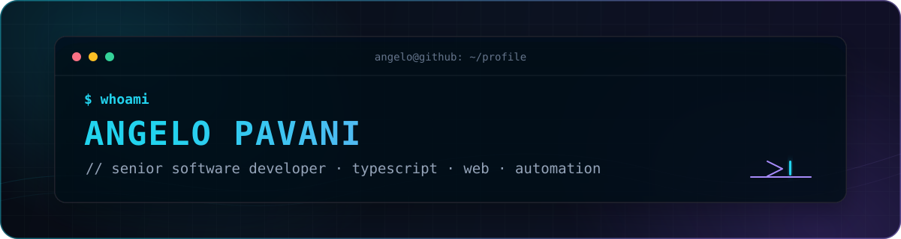

<div align="center">
  

  <br />

  <a href="https://gilopavani.github.io/">
    
  </a>
  <a href="mailto:angelopav.98@gmail.com">
    
  </a>
  <a href="https://github.com/gilopavani?tab=repositories">
    
  </a>
</div>

<br />

```ts
const angelo = {
  role: "Senior Software Developer",
  focus: ["web products", "APIs", "automation"],
  mainStack: ["TypeScript", "React", "Next.js", "Node.js"],
  alsoWorksWith: ["Python", "Django", "Angular", "C#", "C++", "Lua"],
  mindset: "transformar problemas complexos em software simples",
};
```

### `> whoami`

Desenvolvedor de software com foco em **TypeScript** e no ecossistema web. Gosto de construir produtos de ponta a ponta, explorar automações e transformar ideias em experiências rápidas, úteis e bem acabadas.

- Atualmente trabalhando principalmente com **TypeScript**
- Experiência com **front-end, back-end, APIs e automação**
- Sempre refinando arquitetura, DX e qualidade de código
- Baseado no Brasil 🇧🇷

### `> stack --list`

<div align="center">

  **Core**

  <br />

  

  <br /><br />

  **Back-end, dados & ferramentas**

  <br />

  

</div>

### `> ls ./featured-projects`

| Projeto | O que tem por lá | Stack |
| :--- | :--- | :--- |
| **[Gather Controller](https://github.com/gilopavani/gather-ctl)** | Userscript com painel de controle, inspeção de eventos e automações via WebSocket. | `JavaScript` `WebSocket` `esbuild` |
| **[HDR Image Processing](https://github.com/gilopavani/processing_HDR_openCV)** | Pipeline para alinhar, mesclar e aplicar tone mapping em imagens HDR. | `Python` `OpenCV` |
| **[Portfólio](https://github.com/gilopavani/gilopavani.github.io)** | Meu espaço na web para apresentar trabalho, stack e projetos. | `Astro` `HTML` `CSS` `JavaScript` |

### `> git stats --visual`

<div align="center">
  <picture>
    <source media="(prefers-color-scheme: dark)" srcset="https://github-readme-stats.vercel.app/api?username=gilopavani&show_icons=true&hide_border=true&bg_color=00000000&title_color=22D3EE&icon_color=A78BFA&text_color=C9D1D9&ring_color=22D3EE&include_all_commits=true" />
    
  </picture>
  <picture>
    <source media="(prefers-color-scheme: dark)" srcset="https://github-readme-stats.vercel.app/api/top-langs/?username=gilopavani&layout=compact&hide_border=true&bg_color=00000000&title_color=22D3EE&text_color=C9D1D9&langs_count=8" />
    
  </picture>
</div>

<br />

<div align="center">
  <sub><code>while (curious) { build(); learn(); improve(); }</code></sub>
  <br /><br />
  
</div>
